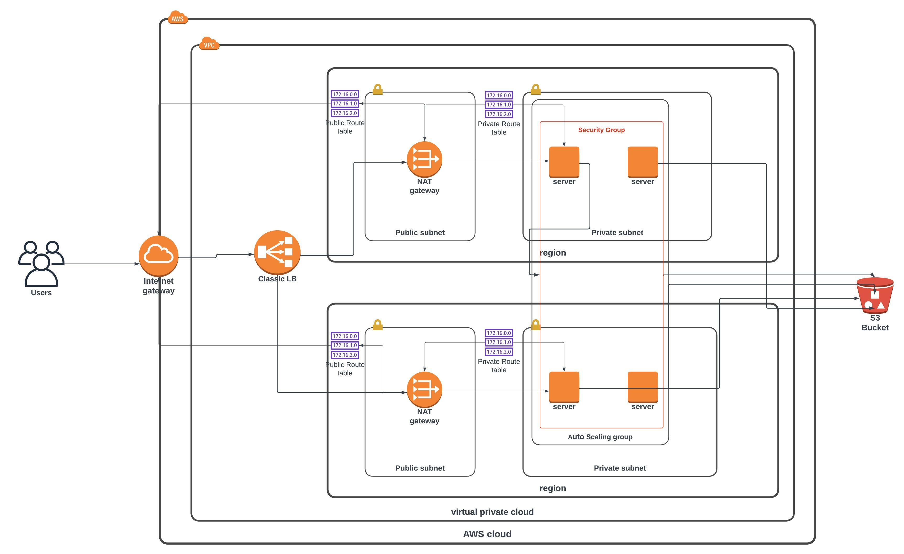

In this project I developed the infrastructure diagram of Udagram App(Instagram clone app) according specified required.
1. draw the infracstructure diagram
2. convert this archticture into code (AWS cloudFormation yaml template)
3. using cloud aws cli to provision 2 stacks (Network and servers stack)

